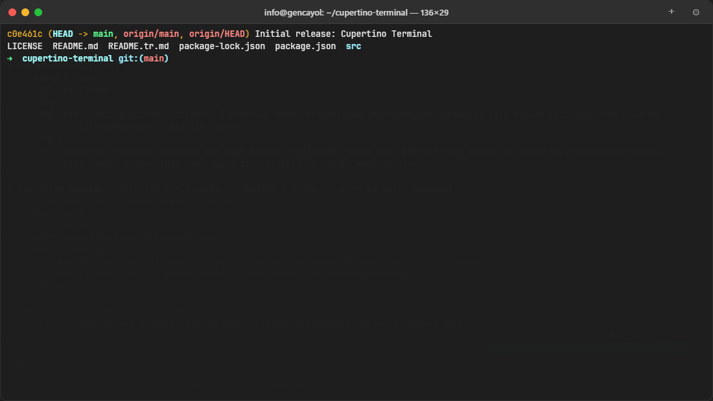

# Cupertino Terminal

> 🇹🇷 [Türkçe](README.tr.md)

**The macOS-grade terminal that isn't Electron.** A real native app — a Rust core driving each operating system's own WebView — so you get a beautiful, Cupertino-style interface at a footprint that ordinary terminals can't touch. Windows, macOS and Linux. Built on Tauri, Rust and xterm.js.



## Why you'll want it on your machine

Most "modern" terminals ship an entire Chromium browser and a Node runtime just to draw a prompt — hundreds of megabytes of RAM before you type a single character. Cupertino Terminal doesn't. There is **no bundled Chromium, no Node, no Electron**. Just a native binary that starts fast, sips memory, and feels like the Mac.

- 🪶 **~10× lighter than an Electron terminal** — a single native binary, **~29 MB idle RAM**, a **56 KB** initial UI payload.
- ⚡ **Sub-frame keystroke latency (~6 ms p95)** on a real PTY streamed as raw bytes with backpressure — no lag, no dropped output on a `yes` flood.
- 🍎 **Genuine macOS feel** — native traffic lights, vibrancy, window dragging, hollow inactive cursor, and Cmd-owns-the-app / Ctrl-goes-to-the-shell key handling that actually respects readline and SIGINT.
- 🔐 **ZeroLink: your own encrypted remote terminal** — SSH-like peer-to-peer shell sharing with end-to-end encryption, built in. No server, no account, no exposed port.
- 🖥️ **One experience on every OS** — what's flawless on Windows is flawless on the Mac. Identical shortcuts, identical polish.
- 🔄 **Signed auto-updates** — the app keeps itself current from GitHub Releases.

If you live in a terminal, this is the one you'll want open all day.

## Install in one command

One line, any machine — it detects your OS and CPU, downloads the right signed installer, and gets you running. Hand this repo to an AI agent and say "install this," and it will do exactly the same (see [AGENTS.md](AGENTS.md)).

**macOS / Linux**

```sh
curl -fsSL https://raw.githubusercontent.com/natureco-official/cupertino-terminal/main/install.sh | sh
```

**Windows (PowerShell)**

```powershell
irm https://raw.githubusercontent.com/natureco-official/cupertino-terminal/main/install.ps1 | iex
```

No admin, no build tools, no `jq` — just `curl`/PowerShell. On macOS it also clears the Gatekeeper quarantine flag for you and launches the app.

## Download

Prefer to install by hand? Grab the latest installer from **[GitHub Releases](https://github.com/natureco-official/cupertino-terminal/releases/latest)** — under a minute to install.

| Platform | Package |
|---|---|
| Windows 10/11 x64 | `x64-setup.exe` |
| Apple Silicon Mac | `aarch64.dmg` |
| Intel Mac | `x64.dmg` |
| Linux x64 | `amd64.AppImage` |

macOS builds are ad-hoc signed (notarization is on the roadmap). On first launch, if Gatekeeper blocks it, open **System Settings → Privacy & Security** and choose **Open Anyway**. Windows builds may show a one-time SmartScreen prompt — choose **More info → Run anyway**.

## Feature highlights

- Native PTY sessions with automatic PowerShell, Command Prompt, WSL, zsh, bash and fish detection
- Ten classic terminal color profiles with adjustable opacity and glass effects
- Tabs plus persistent vertical/horizontal split panes with draggable dividers
- Session restore for tabs, pane layouts, working directories and window state
- Scrollback search (`Ctrl/⌘+F`) and a fuzzy Command Palette (`Ctrl/⌘+Shift+P`)
- Prompt-aware command history with exit status, duration and working directory
- Shell integration for accurate current directory and command state (OSC 7 / OSC 133)
- Bundled JetBrains Mono, Turkish/English interface, Explorer/Finder launch integration

## ZeroLink — encrypted remote terminal, built in

Press `Ctrl/⌘+L` to share a dedicated shell or connect with a one-time code. ZeroLink opens an **end-to-end encrypted, peer-to-peer** remote shell between two machines — interactive sessions, terminal resize, file transfer and local port forwarding — with no central server and no account.

Under the hood: ephemeral **ECDH P-256**, public-key-pinned handshake with a **pairing-key HMAC** mutual-auth (a party without the code cannot connect — verified against a real attacker), **HKDF-SHA256** and **AES-256-GCM** with strict replay/order protection. Codes are one-time and expire after five minutes. Cross-network connectivity depends on NAT; a relay can be configured, and terminal content stays encrypted through it.

## Performance

Measured against Windows Terminal on the same machine:

| Metric | Cupertino Terminal |
|---|---|
| Idle memory (RSS) | ~29 MB |
| Keystroke-to-glyph latency (p95) | ~6 ms |
| Initial renderer payload | 56 KB (down from 543 KB) |
| Bundled browser/Node runtime | none |

## Keyboard shortcuts

Use `⌘` instead of `Ctrl` on macOS.

| Shortcut | Action |
|---|---|
| `Ctrl/⌘+T` | New tab |
| `Ctrl/⌘+W` | Close active pane or tab |
| `Ctrl/⌘+1…9` | Switch tabs |
| `Ctrl/⌘+F` | Search terminal output |
| `Ctrl/⌘+Shift+P` | Command Palette and smart history |
| `Ctrl/⌘+Shift+\` | Split right |
| `Ctrl/⌘+Shift+-` | Split down |
| `Ctrl/⌘+Alt+Right` | Focus the other pane |
| `Ctrl/⌘+,` | Settings |
| `Ctrl/⌘+L` | ZeroLink panel |
| `Ctrl/⌘+C` | Copy selection, otherwise send interrupt |
| `Ctrl/⌘+V` | Paste |

## Run from source

Requirements: Node.js 22+, Git, the Rust toolchain, and the [Tauri v2 prerequisites](https://v2.tauri.app/start/prerequisites/) for your OS (WebView2 on Windows, Xcode command-line tools on macOS, WebKitGTK on Linux).

```powershell
git clone https://github.com/natureco-official/cupertino-terminal.git
cd cupertino-terminal
npm install
npm start          # tauri dev — native window with live reload
```

Quality checks:

```powershell
npm run check            # syntax + unit tests
npm run typecheck        # tsc --noEmit
npm run smoke:tauri      # application smoke
npm run perf:tauri       # PTY/latency benchmark
npm audit --audit-level=high
```

Build installers for the current platform:

```powershell
npm run tauri:build
```

## Shell integration

Cupertino Terminal automatically injects its integration into supported zsh, bash, fish and PowerShell sessions. Runtime files live in the writable application-data directory, never inside the read-only app bundle — reliable current-directory tracking, prompt boundaries, command duration and exit status without touching your shell config. WSL distributions are detected automatically on Windows and preferred when available, otherwise the app falls back to PowerShell.

## Release process

Every push and pull request to `main` passes automated JavaScript, native PTY, application smoke, performance and security checks on real CI — including `cargo check` and `cargo test` on Windows MSVC and Apple Silicon. A `v*` tag additionally builds Windows x64, Apple Silicon macOS, Intel macOS and Linux packages, signs the updater artifacts, and attaches them to a GitHub Release with an auto-update manifest.

## License

MIT — see [LICENSE](LICENSE). JetBrains Mono is included under the [SIL Open Font License 1.1](src/fonts/OFL.txt).

Cupertino Terminal is independent software and is not affiliated with or endorsed by Apple Inc. macOS and Terminal.app are trademarks of Apple Inc.

Part of the [NatureCo](https://natureco.me) ecosystem.
